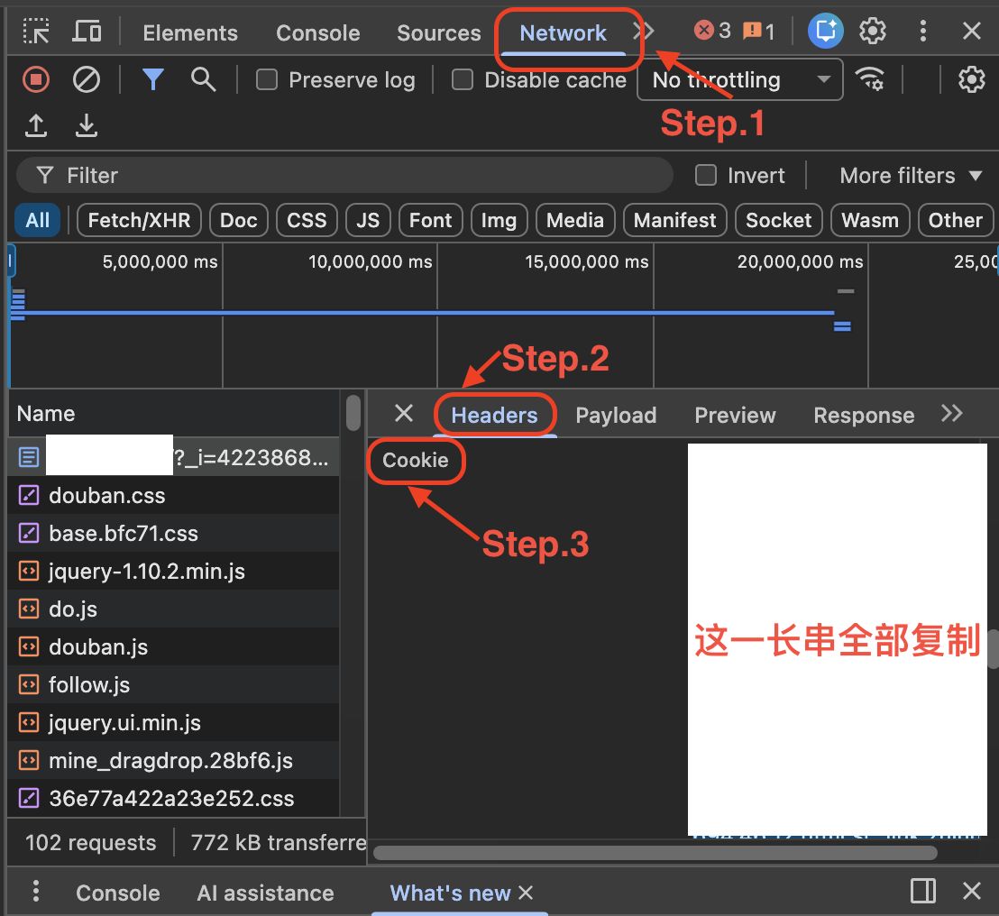

# 豆瓣导出笔记并翻译迁移至外网教程

适用场合：希望迁移至其他平台进行notes发布。show off your literature taste :)

## 功能
- `douban_crawl.py`：抓取豆瓣书/电影（含评分、评论、作者/导演），输出 `douban_books_raw.json`、`douban_movies_raw.json`、合并 `douban_export_raw.json`。
- `douban_translate.py`：用 Qwen 翻译标题与评论，生成 `douban_books_translated.json`、`douban_movies_translated.json`、合并 `douban_export_translated.json`。作者/导演会尽量转为英文名。
- `search.py`：基于已翻译的标题/作者/导演，自动搜索 Goodreads / IMDb 生成相应的url对应，减少手动查询。
- `import_data.py`：读取翻译后的数据，按映射发布到 Goodreads / IMDb（需事先登录并提供映射文件）。


## 准备
1. 安装依赖：`pip install -r requirements.txt`。如用 Playwright，额外执行 `playwright install`。
2. 设置环境变量：
   - `DOUBAN_COOKIE`：浏览器登录豆瓣后的 Cookie 字符串。可通过开发者工具获取，只需要在浏览douban页面时打开：
      
   - `DOUBAN_USER_ID`：你的豆瓣 people ID。打开个人主页上copy url中的内容：
      
   - `QWEN_API_KEY`：Qwen api key ；需自己申请自定义，也可以换其他的LLM（但是调用接口需要改），阿里的通义api key申请可见： [通义api申请](https://dashscope.console.aliyun.com/)。
3. 映射文件（发布用，通过search.py自动匹配，*但是需要人工check，很容易搜到summary之类的条目）：
   - `goodreads_targets.json`：`[{"subject_url": "https://book.douban.com/subject/xxx/", "target_url": "https://www.goodreads.com/book/show/123"}]`
   - `imdb_targets.json`：`[{"subject_url": "https://movie.douban.com/subject/yyy/", "target_url": "https://www.imdb.com/title/tt123/reviews"}]`
   - *注意* 运行 `python search.py` 会自动搜索 Goodreads/IMDb 并生成上述映射文件（需可访问对应站点，默认 1.5s 间隔，可加 `--overwrite` 覆盖已有映射）。 

### 环境变量设置示例（macOS/Linux）
```bash
# 临时生效：写入当前终端，会话关闭后失效
export DOUBAN_COOKIE='你的cookie字符串'
export DOUBAN_USER_ID='你的people ID'
export QWEN_API_KEY='你的Q wen密钥'


# 永久生效：在 ~/.zshrc 或 ~/.bashrc 里追加
echo "export DOUBAN_COOKIE='...'" >> ~/.zshrc
echo "export DOUBAN_USER_ID='...'" >> ~/.zshrc
echo "export QWEN_API_KEY='...'" >> ~/.zshrc
source ~/.zshrc
```

## 使用
1. 抓取：
   ```bash
   python douban_crawl.py
   ```
2. 翻译：
   ```bash
   python douban_translate.py
   ```
3. 发布（可选，需先在弹出的浏览器中登录）：
   ```bash
   python search.py
   Python import_data.py
   ```

## 输出结构（翻译后）
```json
{
    "category": "book",
    "title": "The Garlic Ballads",
    "comment": "I feel that the expression of Japanese literature I like is like a plum rain that never seems to stop, while this book feels like a violent storm crashing through the treetops. It's been a long time since I've felt the brevity, strength, and balance of tenderness and power in Chinese writing.",
    "rating": 5,
    "subject_url": "https://book.douban.com/subject/20257953/",
    "author": "Mo Yan"
}
```
